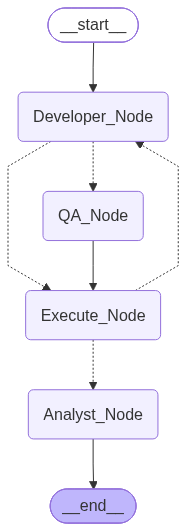

# LangGraph TDD Pipeline

An autonomous multi-agent system that uses a self-healing Test-Driven Development loop to generate, validate, and analyse a high-volume telecom log parser — orchestrated with LangGraph and driven by a locally-hosted Llama 3 model via Ollama.

---

## Architecture

The pipeline is implemented as a directed `StateGraph` with four nodes and conditional routing. On every cycle the graph evaluates whether the generated code passes the test suite; if it does not, it re-routes to the developer agent for an autonomous patch attempt (up to `MAX_ITERATIONS = 3`). Once the test suite passes, control is forwarded to the analyst agent, which computes data-quality metrics and generates an executive report.

```
Developer_Node ──► QA_Node ──► Execute_Node ──┬──► Analyst_Node ──► END
      ▲                              │          │
      └──────────── retry ◄──────────┘ (fail)
                                               └── (pass or limit reached)
```



### Node Responsibilities

| Node | Role |
|---|---|
| `Developer_Node` | Invokes the LLM to generate a `Parser` class from scratch, or to patch it based on the traceback from a failed test run. |
| `QA_Node` | Produces a deterministic pytest suite targeting the generated parser and the `data/telecom_traffic.jsonl` corpus. |
| `Execute_Node` | Writes the generated code and tests to disk, invokes `pytest` via subprocess, captures output, and sets the `error` state field accordingly. |
| `Analyst_Node` | Executes the validated parser via `exec()`, computes concrete telemetry metrics, and prompts the LLM to synthesise an executive health report. |

---

## Key Features

- **Local Llama 3 Execution**
  - Zero external API calls. The LLM is served locally via [Ollama](https://ollama.com) and accessed through `langchain-ollama`.
  - Model: `llama3` — `temperature=0.1`, `num_predict=2048`.

- **Autonomous TDD Self-Healing Loop**
  - The `Developer_Node` → `Execute_Node` cycle retries autonomously up to 3 times.
  - On failure, the full traceback is injected back into the developer prompt so the LLM can perform targeted, context-aware patches.
  - The `QA_Node` uses a hard-coded deterministic test template — not LLM-generated — to eliminate non-determinism in the test harness.

- **Bulk Stream Processing**
  - The generated `Parser` class reads `telecom_traffic.jsonl` (10,000 lines) line-by-line using a Python generator (`yield`), maintaining a constant memory footprint regardless of file size.
  - Malformed records (SIP fragments, mismatched ASN.1 lengths, invalid 5G JSON field types) are caught, logged as `WARNING`, and skipped without interrupting the stream.

- **Automated Executive Reporting**
  - After tests pass, `Analyst_Node` calculates: total records processed, valid record count, malformed record count, and average `SignalStrength` of valid records.
  - These metrics are forwarded to the LLM, which generates a structured Markdown executive report saved to `output/system_health_report.md`.

- **Structured Output & Observability**
  - `output/report.html` — interactive pytest-html test report.
  - `output/pytest_run.log` — structured `INFO`/`WARNING` log from each test run.
  - `output/pipeline_architecture.png` — Mermaid-rendered graph diagram of the compiled workflow.
  - `output/system_health_report.md` — LLM-generated executive health report.

---

## Project Structure

```
Multi_Agent/
├── main.py                        # Entry point; graph definition and execution loop
├── src/
│   ├── __init__.py
│   ├── state.py                   # GraphState TypedDict schema
│   └── tooling.py                 # execute_pytest() — subprocess test runner
├── scripts/
│   ├── setup_db.py                # Initialises scenarios.db with chaos scenarios
│   └── generate_bulk_logs.py      # Generates telecom_traffic.jsonl (10,000 records)
├── data/
│   ├── scenarios.db               # SQLite database of telecom error patterns
│   └── telecom_traffic.jsonl      # 80% valid 5G telemetry / 20% chaos records
└── output/
    ├── system_health_report.md
    ├── pipeline_architecture.png
    ├── report.html
    └── pytest_run.log
```

---

## Quickstart

### Prerequisites

- Python 3.11+
- [Ollama](https://ollama.com) installed and running with the `llama3` model pulled:

```bash
ollama pull llama3
```

### Installation

```bash
git clone https://github.com/BenniKensei/TDD_pipeline
cd TDD_pipeline
python -m venv venv
# Windows
venv\Scripts\activate
# macOS / Linux
source venv/bin/activate

pip install -r requirements.txt
```

### Data Generation (first run only)

```bash
# Populate scenarios.db with telecom chaos patterns
python scripts/setup_db.py

# Generate the 10,000-record JSONL corpus
python scripts/generate_bulk_logs.py
```

### Execute the Pipeline

```bash
python main.py
```

---

## Execution Trace

The following trace represents a successful first-iteration run. The pipeline completes without requiring any autonomous patch cycles.

```
Pipeline architecture exported to output\pipeline_architecture.png
Starting Multi-Agent LangGraph System...
Active Node: Developer_Node   Iterations: 0 / 3   Status: OK.
Active Node: QA_Node          Iterations: 0 / 3   Status: OK.
Active Node: Execute_Node     Iterations: 1 / 3   Status: OK.
Active Node: Analyst_Node     Iterations: 1 / 3   Status: OK.
───────────────────────── Graph Execution Complete ─────────────────────────
Total Iterations: 1

[Final Status]: SUCCESS
──────────────────────────────── Metrics ───────────────────────────────────
  total_records:        11340
  valid_records:         8667
  malformed_records:     2673
  avg_signal_strength:  -85.59
──────────────────────────── Executive Report ───────────────────────────────
# Executive System Health Report
...
Report saved to: output\system_health_report.md
```

The full analyst output is written to [`output/system_health_report.md`](output/system_health_report.md) after every successful run.

---

## State Schema

```python
class GraphState(TypedDict):
    code: str          # LLM-generated parser source
    tests: str         # Deterministic pytest suite
    test_output: str   # Raw pytest stdout/stderr
    iterations: int    # Cycle counter (max: MAX_ITERATIONS)
    error: str         # Traceback from last failed run; empty on success
    report: str        # LLM-generated executive report body
    metrics: dict      # Computed telemetry statistics
```

---

## Dependencies

| Package | Purpose |
|---|---|
| `langgraph` | Stateful multi-agent graph orchestration |
| `langchain-ollama` | LangChain adapter for locally-hosted Ollama models |
| `rich` | Terminal status spinner and styled console output |
| `pytest` | Test runner invoked via subprocess in `Execute_Node` |
| `pytest-html` | Interactive HTML test report generation |

---

## License

MIT
